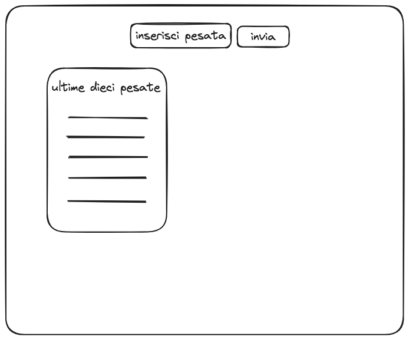

# README
Se viene ricercata la root ci possono essere due risposte differenti:

1) nel caso in cui l'utente sia già loggato verrà mostrata la pagina dell'homepage

2) nel caso in cui un utente non sia loggato verrà redirezionato sulla pagina del login

La pagina dell'homepage è composta da un form in cui inserire la nuova pesata, una lista delle ultime 10 pesate inserite 

La lista delle ultime 10 pesate avrà la possibilità di mostrare anche tutto l'archivio delle pesate caricate cliccando su un link "vedi tutte".
La pagina a cui si verrà redirezionati conterrà la lista di tutte le pesate e una paginazione che permetterà in base al numero di pesate caricate di cambiare pagina.

